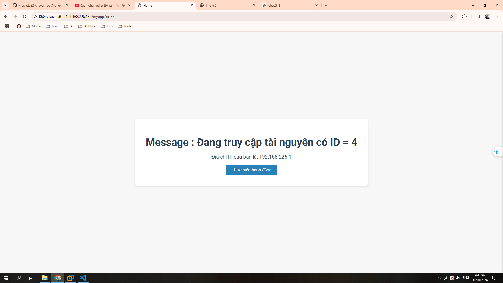
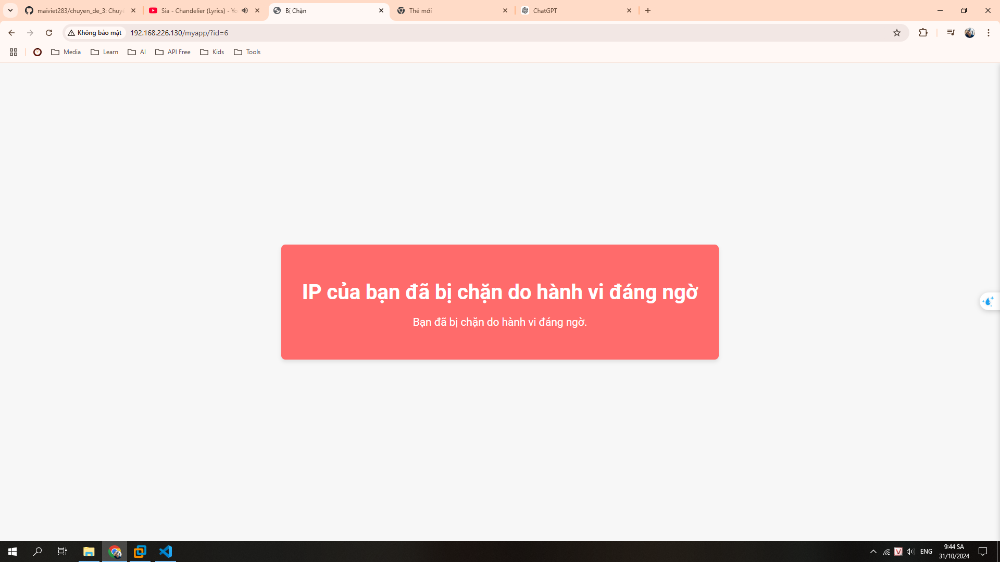

# Demo Sản Phẩm

## Giới thiệu

Trong dự án này, chúng tôi đã phát triển một ứng dụng web sử dụng Django với middleware để chặn các IP có hành vi đáng ngờ. Ứng dụng sẽ hiển thị hai trạng thái khác nhau tùy thuộc vào việc người dùng có bị chặn hay không.

## Trạng thái khi vào trang web

Khi người dùng truy cập trang web lần đầu tiên, giao diện sẽ như sau:

Trong giao diện này, người dùng có thể nhập ID và gửi yêu cầu để truy cập tài nguyên.

## Trạng thái khi bị chặn

Nếu người dùng nhập quá nhiều ID không hợp lệ và bị chặn, giao diện sẽ chuyển sang trạng thái như sau:

Giao diện này hiển thị thông báo rằng IP của người dùng đã bị chặn do hành vi đáng ngờ.

## Kết luận

Dự án này giúp nâng cao an ninh cho ứng dụng web bằng cách ngăn chặn những hành vi không mong muốn từ người dùng. Hệ thống sẽ theo dõi các yêu cầu từ IP và chặn chúng nếu phát hiện có quá nhiều yêu cầu không hợp lệ trong một khoảng thời gian ngắn.
